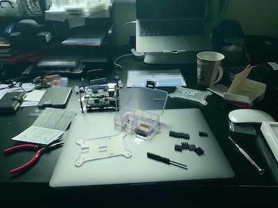
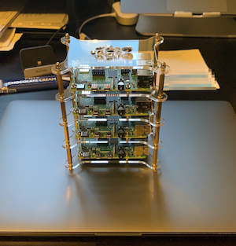

# Bill of Materials

The following is a list of the components that go together to build the cluster.

## Components

* 4x [Raspberry Pi 4 Model B 4GB](https://www.amazon.co.uk/gp/product/B07TC2BK1X/ref=ppx_yo_dt_b_asin_title_o01_s02?ie=UTF8&psc=1)
* 4x [SanDisk Ultra 32GB MicroSD](https://www.amazon.co.uk/gp/product/B073JWXGNT/ref=ppx_yo_dt_b_asin_title_o01_s01?ie=UTF8&psc=1)
* 4x [SanDisk Ultra Fit 128 GB USB 3.1 Flash Drive](https://www.amazon.co.uk/gp/product/B07855LJ99/ref=ppx_yo_dt_b_asin_title_o04_s00?ie=UTF8&psc=1)
* 4x [High Speed Flat Cat7 Ethernet Cable](https://www.amazon.co.uk/gp/product/B07LCKXLTF/ref=ppx_yo_dt_b_asin_title_o01_s01?ie=UTF8&psc=1)
* 1x [Anker PowerPort 60W 10-Port USB Charging Hub](https://www.amazon.co.uk/gp/product/B00YSA0WI8/ref=ppx_od_dt_b_asin_title_s01?ie=UTF8&psc=1)
* 1x [NETGEAR 8-Port Gigabit Ethernet Network Switch](https://www.amazon.co.uk/gp/product/B07QHD134G/ref=ppx_od_dt_b_asin_title_s01?ie=UTF8&psc=1)
* 1x [Bewinner 4 Layers Transparent Acrylic Case Shelf Stack](https://www.amazon.co.uk/dp/B07P2VLJXV?tag=duckduckgo-ffab-uk-21&linkCode=osi&th=1&psc=1)

## Construction (How to draw an owl)

In the tradition of [How to draw an owl](https://www.reddit.com/r/funny/comments/eccj2/how_to_draw_an_owl/)
here are some instructions on how to build the cluster

### Draw some circles

### Draw the rest of the owl

