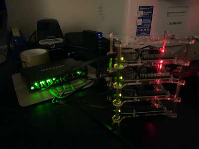
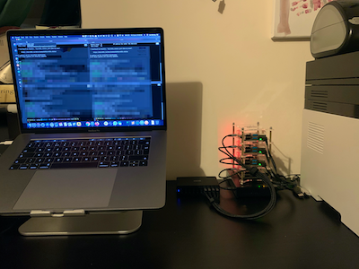
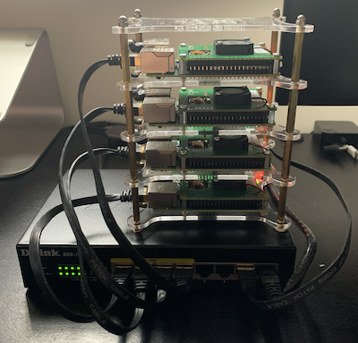

# Bill of Materials

The following is a list of the components from which the cluster is composed.

## Table of Contents

<!-- toc -->

- [Phase 1 - SD Cards](#phase-1---sd-cards)
  * [Components](#components)
  * [Construction (How to draw an owl)](#construction-how-to-draw-an-owl)
    + [Draw some circles](#draw-some-circles)
    + [Draw the rest of the owl](#draw-the-rest-of-the-owl)
    + [Don't forget good cable management](#dont-forget-good-cable-management)
- [Phase 2 - USB Boot Drives (NVMe.M2 drives; incompatible adapters)](#phase-2---usb-boot-drives-nvmem2-drives-incompatible-adapters)
  * [Components 2](#components-2)
- [Phase 3 - USB Boot Drives (NVMe.M2 drives; compatible adapters; not enough power)](#phase-3---usb-boot-drives-nvmem2-drives-compatible-adapters-not-enough-power)
  * [Components 3](#components-3)
- [Phase 4 - PoE (NVMe.M2 drives; compatible adapters; enough power now? No)](#phase-4---poe-nvmem2-drives-compatible-adapters-enough-power-now-no)
  * [Components 4](#components-4)
- [Phase 5 - PoE (SanDisk drives; noisy fans!)](#phase-5---poe-sandisk-drives-noisy-fans)
- [Phase 6 - Future plans (NVMe.M2 drives)](#phase-6---future-plans-nvmem2-drives)
- [References](#references)
  * [Setting up USB as a bootable operating system](#setting-up-usb-as-a-bootable-operating-system)
  * [Raspberry Pi Settings](#raspberry-pi-settings)

<!-- tocstop -->

## Phase 1 - SD Cards

The first phase of the build set the cluster up using just SD cards to host the OS. This was a good first start but
there's always the nagging doubt that the SD cards will fail at some point. Additionally, I never actually installed the
Kubernetes cluster at this point.

### Components

* 4x [Raspberry Pi 4 Model B 4GB](https://www.amazon.co.uk/gp/product/B07TC2BK1X/ref=ppx_yo_dt_b_asin_title_o01_s02?ie=UTF8&psc=1)
* 4x [SanDisk Ultra 32GB MicroSD](https://www.amazon.co.uk/gp/product/B073JWXGNT/ref=ppx_yo_dt_b_asin_title_o01_s01?ie=UTF8&psc=1)
* 4x [SanDisk Ultra Fit 128 GB USB 3.1 Flash Drive](https://www.amazon.co.uk/gp/product/B07855LJ99/ref=ppx_yo_dt_b_asin_title_o04_s00?ie=UTF8&psc=1)
* 4x [High Speed Flat Cat7 Ethernet Cable](https://www.amazon.co.uk/gp/product/B07LCKXLTF/ref=ppx_yo_dt_b_asin_title_o01_s01?ie=UTF8&psc=1)
* 1x [Anker PowerPort 60W 10-Port USB Charging Hub](https://www.amazon.co.uk/gp/product/B00YSA0WI8/ref=ppx_od_dt_b_asin_title_s01?ie=UTF8&psc=1)
* 1x [NETGEAR 8-Port Gigabit Ethernet Network Switch](https://www.amazon.co.uk/gp/product/B07QHD134G/ref=ppx_od_dt_b_asin_title_s01?ie=UTF8&psc=1)
* 1x [Bewinner 4 Layers Transparent Acrylic Case Shelf Stack](https://www.amazon.co.uk/dp/B07P2VLJXV?tag=duckduckgo-ffab-uk-21&linkCode=osi&th=1&psc=1)

### Construction (How to draw an owl)

In the tradition of [How to draw an owl](https://www.reddit.com/r/funny/comments/eccj2/how_to_draw_an_owl/) here are
some instructions on how to build the cluster.

#### Draw some circles

#### Draw the rest of the owl

#### Don't forget good cable management

## Phase 2 - USB Boot Drives (NVMe.M2 drives; incompatible adapters)

This second phase came about after I found some articles (listed below) that show how you can boot from a USB disk. This
replaces the need to rely on the SD cards. However, it was discovered that the adapters used to mount NVMe.M2 drives
were not compatible, and the Raspberry Pi really didn't want to recognise the drive or boot from it.

### Components 2

* 4x [Samsung 970 EVO Plus 500GB PCIe NVMe M.2](https://www.amazon.co.uk/gp/product/B07MFBLN7K/ref=ppx_yo_dt_b_asin_title_o04_s00?ie=UTF8&psc=1)
* 4x [FIDECO M.2 NVME and SATA External SSD Enclosure](https://www.amazon.co.uk/gp/product/B08CGJYJ7F/ref=ppx_yo_dt_b_asin_title_o04_s01?ie=UTF8&psc=1)

## Phase 3 - USB Boot Drives (NVMe.M2 drives; compatible adapters; not enough power)

Upon discovering the adapters were to blame for the operating system not booting up, I purchased some different adapters
that allowed me to install the Ubuntu OS onto them, remove the SD cards and boot into the OS from the USB drive. This
was great until I started getting random `key exchange` and `input/output error` errors. The `apt` updates would fail,
sometimes the whole OS would freeze up. After some searching it became apparent that the SSDs were not getting enough
power from the USB hub (which was a powered hub, so it should have been ok). I decided to try and use PoE as I thought
this might supply more, consistent power to the nodes.

### Components 3

* 4x [RIITOP M2 SSD to USB 3.0 M.2 to USB Adapter](https://www.amazon.co.uk/gp/product/B08L9KLQTX/ref=ppx_yo_dt_b_asin_title_o01_s00?ie=UTF8&psc=1)

## Phase 4 - PoE (NVMe.M2 drives; compatible adapters; enough power now? No)

This setup removed the need for the USB hub (hooray, fewer cables to manage), but it soon became apparent that even with
PoE, it was not enough juice to drive the SSD drives. It seems that the NVMe.M2 drives need 2.7A, and the PoE switch is
only supplying 2.4A, or the PoE hats which only supply 5V/2.5A DC output? Either way, the drives were still failing to
mount a stable OS.

### Components 4

* 1x [D-Link DGS-1008P/E 8-Port Gigabit 4PoE ports](https://www.amazon.co.uk/gp/product/B004FJSST2/ref=ppx_yo_dt_b_asin_title_o00_s00?ie=UTF8&psc=1)
* 4x [Raspberry Pi Power over Ethernet (PoE) HAT v2.0](https://thepihut.com/products/raspberry-pi-power-over-ethernet-poe-hat)

## Phase 5 - PoE (SanDisk drives; noisy fans!)

At this point I have reverted to using the SanDisk USB keys to host the OS, remove the NVMe drives completely and so far
this setup has worked, and is stable. However, the fans are incredibly noisy, so I will be fiddling with the fan start
up and shut down settings using the `config.txt`; this will be achieved via Ansible.

## Phase 6 - Future plans (NVMe.M2 drives)

The dream of using the NVMe.M2 drives is not over, I just need to figure out their power supply issues

## References

### Setting up USB as a bootable operating system
* [New Raspberry Pi 4 Bootloader USB Boot Guide](https://jamesachambers.com/new-raspberry-pi-4-bootloader-usb-network-boot-guide/)
* [Raspberry Pi 4 Ubuntu 20.10 USB Mass Storage Boot Guide](https://jamesachambers.com/raspberry-pi-4-ubuntu-20-04-usb-mass-storage-boot-guide/)
* [Official documentation](https://www.raspberrypi.org/documentation/hardware/raspberrypi/bootmodes/msd.md)
* [Another great article](https://www.zdnet.com/article/booting-my-raspberry-pi-4-from-a-usb-device/)
* [Raspberry Pi USB support documentation](https://www.raspberrypi.org/documentation/hardware/raspberrypi/usb/README.md#support)

### Raspberry Pi Settings
* [Bootloader](https://www.raspberrypi.org/documentation/hardware/raspberrypi/bcm2711_bootloader_config.md)
* [booteeprom](https://www.raspberrypi.org/documentation/hardware/raspberrypi/booteeprom.md)
* [config.txt (memory)](https://www.raspberrypi.org/documentation/configuration/config-txt/memory.md)
* [Fan control](https://jjj.blog/2020/02/raspberry-pi-poe-hat-fan-control/)
